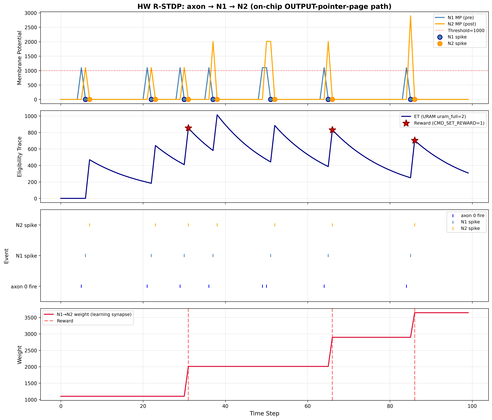

# 4.1 What is R-STDP?

R-STDP, or **Reward-modulated Spike-Timing-Dependent Plasticity**, is a learning rule for spiking neural networks. It takes a classic *unsupervised* rule (STDP) and turns it into a *supervised* one using a global reward signal that, in biology, is delivered by dopamine.

The rest of Chapter 4 implements R-STDP in FPGA hardware. This page explains the rule. The structure follows Izhikevich (2007), [PMID 17220510](https://pubmed.ncbi.nlm.nih.gov/17220510/), the canonical computational treatment and the paper whose model our hardware operationalizes.

---

## STDP: unsupervised Hebbian learning at one synapse

For each synapse from a pre-synaptic neuron to a post-synaptic neuron, STDP looks at the relative spike timing:

$$\Delta t = t_{post} - t_{pre}$$

$$W(\Delta t) = \begin{cases}
A_+ e^{-\Delta t / \tau_+} & \Delta t \geq 0 \quad \text{(strengthen)} \\
-A_- e^{\Delta t / \tau_-} & \Delta t < 0 \quad \text{(weaken)}
\end{cases}$$

- **Pre fires before post** → synapse *strengthens* (potentiation).
- **Post fires before pre** → synapse *weakens* (depression).
- Effect size shrinks exponentially with `|Δt|`. Spikes more than ~50 ms apart contribute essentially nothing.

This is **unsupervised** learning. There is no teacher, no target, no reward. The synapse changes based purely on local spike timing. "Cells that fire together wire together" is Hebb's slogan; STDP is the timing-sensitive version of it.

The problem with unsupervised plasticity: most of the time, a coincident pre/post spike is just noise. You don't want to reinforce noise.

---

## Adding supervision: dopamine as a global teacher signal

In biology, plasticity is *gated* by a global neuromodulator. The most important one is **dopamine** (DA). Dopamine is released from a small set of midbrain neurons (VTA and SNc) that broadcast to the whole striatum and cortex.

The dopamine signal carries a **reward prediction error** (Schultz et al. 1997). It goes up when reward is better than expected, down when worse, and stays at baseline when there is no surprise. That's the signal R-STDP uses to decide whether a coincident pre/post event was meaningful or noise.

The rule, in plain English:

| Change in dopamine | Weight change at active synapses |
|---|---|
| **Positive ΔDA** (reward better than expected) | Synapses that just had STDP-eligible activity get **strengthened**. |
| **Negative ΔDA** (reward worse than expected) | Synapses that just had STDP-eligible activity get **weakened**. |
| **No ΔDA** (no surprise) | **No learning.** STDP activity is ignored. |

So now we have a supervised rule. The STDP coincidence tells us *which* synapses might be involved; the dopamine change tells us *whether* to act on that information and in which direction.

---

## The delayed reward problem

There's still a timing problem. The STDP window is ~50 ms wide. But the actions a brain wants to learn from rarely produce reward that fast:

- A rat enters the correct maze arm → finds food *10 seconds later*.
- An agent picks a move in chess → wins or loses *minutes later*.

By the time dopamine arrives, the STDP window has long since closed. The synapses that drove the action no longer "know" they were the ones responsible. We need something that *remembers* the STDP event long enough for the eventual reward to land on it.

---

## The eligibility trace: a slow-decay memory of recent STDP events

The fix is to add a per-synapse scalar called the **eligibility trace** `c(t)`. It works like this:

1. Whenever STDP would have changed the weight, instead **bump the eligibility trace** by that amount.
2. The trace **decays slowly over time** like a leaky integrator with a long time constant.
3. The actual weight only changes when dopamine arrives, and the change is proportional to the current eligibility:

$$\dot{w}(t) = R(t) \cdot c(t)$$

Each part of this formula is important:

- `c(t)` says *which* synapses are eligible to learn (those with recently active engrams).
- `R(t)` says *whether* to learn and *in which direction*.
- Their product says *how much*: large eligibility plus large reward gives a large weight change.

### The decay rates are not equal

The trick is in the **time constants**:

| Variable | Typical time constant | Role |
|---|---|---|
| Membrane potential | ~10-20 ms | Whether the neuron spikes *now* |
| STDP window | ~20-50 ms | Whether two spikes count as coincident |
| **Eligibility trace** | **~1 second (biology); configurable in our hardware** | **Whether reward arriving *later* should attribute back to this synapse** |
| Synaptic weight | minutes to forever | Long-term memory |

The eligibility trace is **much slower than the membrane potential** but much faster than the weight itself. That's what lets it bridge the gap between action and reward.

### Reading the eligibility trace value

Here is the intuition that makes R-STDP click:

> **A high `c(t)` means an STDP event happened recently at this synapse. The engram is fresh, and we are confident this synapse was part of whatever the brain just did.**
>
> **A low `c(t)` means the STDP event happened a while ago. The engram is old, and we are less confident that *this* synapse was part of the action that's now being rewarded.**

When the dopamine signal arrives, it multiplies in. Synapses with high `c(t)` get a large weight update; synapses with low `c(t)` get a small one; synapses whose `c(t)` has fully decayed get nothing. The decay rate sets how far back in time the reward signal can reach.

This is direct credit assignment over time, computed locally at each synapse, with no need to remember which neurons fired when.

<div style="background-color: #fef3e2; border-left: 4px solid #f59e0b; padding: 12px 16px; margin: 20px 0; border-radius: 4px;">
<strong>Biology fun fact: synaptic tagging</strong>
<p>The eligibility trace is not just a convenient piece of math. Real synapses appear to do something very similar at the molecular level. Frey &amp; Morris (1997) discovered that after strong pre/post activity, a synapse sets a transient molecular <em>synaptic tag</em>, a state lasting roughly an hour. Separately, when a neuromodulator like dopamine arrives, the cell body synthesizes <em>plasticity-related proteins</em>, which diffuse out through the dendritic tree. The proteins only get "captured" at tagged synapses; untagged ones see them float by and ignore them. The tag is the biological eligibility trace; the proteins-plus-dopamine signal is the reward gate.</p>
<p>Candidate molecular tags include sustained CaMKII activity, phosphorylation of the AMPA receptor subunit GluA1, and actin polymerization at the post-synaptic density. Read Redondo &amp; Morris (2011) for the modern synthesis.</p>
</div>

---

## Putting it together: the R-STDP rule

$$\dot{c}(t) = -\frac{c(t)}{\tau_c} + \text{STDP}(\Delta t) \cdot \delta(t - t_{spike})$$

$$\dot{w}(t) = R(t) \cdot c(t)$$

In words, every synapse runs the following loop:

1. **Spike event** → if pre and post fired close together, bump the eligibility trace `c(t)` by the STDP amount.
2. **Every cycle** → the trace decays slightly toward zero (governed by `τ_c`).
3. **Dopamine event** → multiply the current `c(t)` by the reward signal `R(t)` and add it to the synaptic weight `w(t)`.

The trace is the synapse's short-term memory of "I recently did something Hebbian." The reward signal decides whether that memory becomes a long-term weight change.

### Why this solves the delayed reward problem

```
Time:     0ms         50ms        100ms       500ms       1000ms
          │           │           │           │           │
Activity: [Pre→Post]  [STDP       [eligibility trace      │
          spike       window      still elevated...]       │
          timing      closes]                              │
                                                           [REWARD!]
                                                           └─> Updates all
                                                               eligible synapses
```



*Simulation trace from the R-STDP-enabled hardware (`prelimenary_rstdp/step_6a`). The eligibility trace rises on coincident pre/post activity, persists while pre/post activity continues, and a delayed reward signal converts the eligible synapse's accumulated trace into a weight change.*

Without the eligibility trace, the reward at 1000 ms has nothing to bind to, because the STDP window closed 950 ms earlier. With the eligibility trace, every recently-active synapse carries its own "I was relevant" marker, and reward just multiplies in. The brain (or the FPGA) never has to remember which neurons fired when.

---

## Vocabulary: biology terms used on this page

| Term | Meaning |
|---|---|
| **STDP** (Spike-Timing-Dependent Plasticity) | Local rule: a synapse strengthens if pre fires before post, weakens if post fires before pre. Unsupervised on its own. |
| **Hebbian learning** | Any learning rule of the form "neurons that fire together wire together." STDP is the timing-sensitive version. |
| **LTP** (long-term potentiation) | Long-lasting increase in synaptic strength. The "strengthen" direction of STDP. |
| **LTD** (long-term depression) | Long-lasting decrease in synaptic strength. The "weaken" direction of STDP. |
| **Engram** | The pattern of synaptic activity that encodes a specific memory or learned association. When we say "engram occurred," we mean the network briefly carried that pattern. A fresh STDP event implies the corresponding engram was recent. |
| **Dopamine (DA)** | A neuromodulator broadcast from midbrain to striatum and cortex. Carries a reward prediction error signal. The biological `R(t)` in R-STDP. |
| **Reward prediction error (RPE)** | The mismatch between expected and received reward. Positive when reward is better than expected, negative when worse. Dopamine encodes this. |
| **VTA / SNc** | Ventral Tegmental Area and Substantia Nigra pars compacta, the two midbrain regions that send the dopamine signal. |
| **Striatum** | The main input nucleus of the basal ganglia. The region most densely innervated by dopamine, and the canonical biological substrate for R-STDP. |
| **Eligibility trace** `c(t)` | A per-synapse scalar that records recent STDP events and decays slowly. The synapse's "I'm currently eligible to learn" state. |
| **Synaptic tag** | The molecular implementation of the eligibility trace, a transient state set at a synapse after Hebbian activity (see the fun-fact box above). |
| **Plasticity-related proteins (PRPs)** | Proteins synthesized in the cell body in response to dopamine that consolidate plasticity at tagged synapses. |
| **NMDA receptor** | A post-synaptic glutamate receptor that opens only when pre fires *and* post is depolarized. The molecular coincidence detector underlying STDP. |

---

## Summary

**R-STDP = STDP + eligibility trace + reward signal.**

- **STDP** is local and unsupervised. It detects coincident pre/post spikes but cannot tell which coincidences matter.
- **Reward (dopamine)** turns it into supervised learning: positive ΔDA strengthens active synapses, negative ΔDA weakens them, zero ΔDA means no learning.
- **The eligibility trace** bridges the time gap between activity and reward by decaying much more slowly than the membrane potential. A synapse stays eligible to learn long after the STDP event itself.
- The combined rule `dw/dt = R(t) · c(t)` does **delayed credit assignment**: rewarding actions is possible even when the rewarded outcome arrives seconds after the neural activity that caused it.

Next: [4.2](4_2_synapse_read_write) covers the existing software API for reading and writing synapse weights. Then [4.3](4_3_rstdp_hardware_roadmap) is the entry point into how the FPGA implements R-STDP.

**Read this if you read nothing else:** Izhikevich (2007), "Solving the distal reward problem through linkage of STDP and dopamine signaling," *Cerebral Cortex* 17:2443-2452 ([PMID 17220510](https://pubmed.ncbi.nlm.nih.gov/17220510/)). Our hardware operationalizes his formal model.
